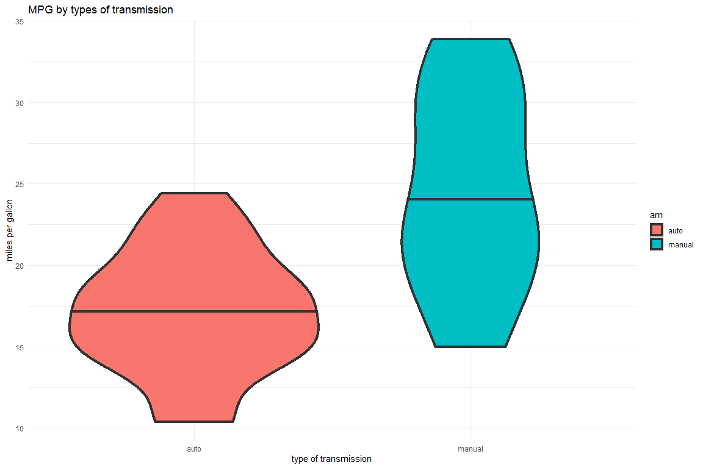
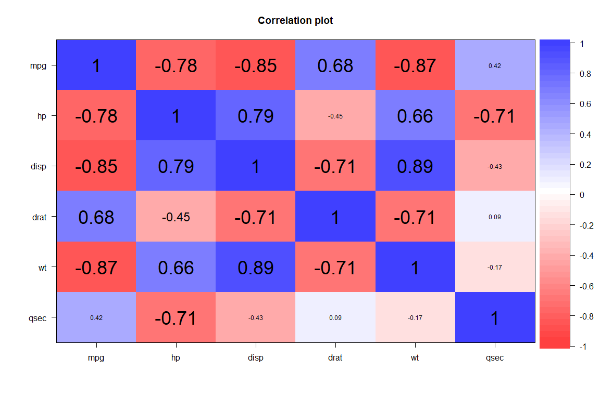
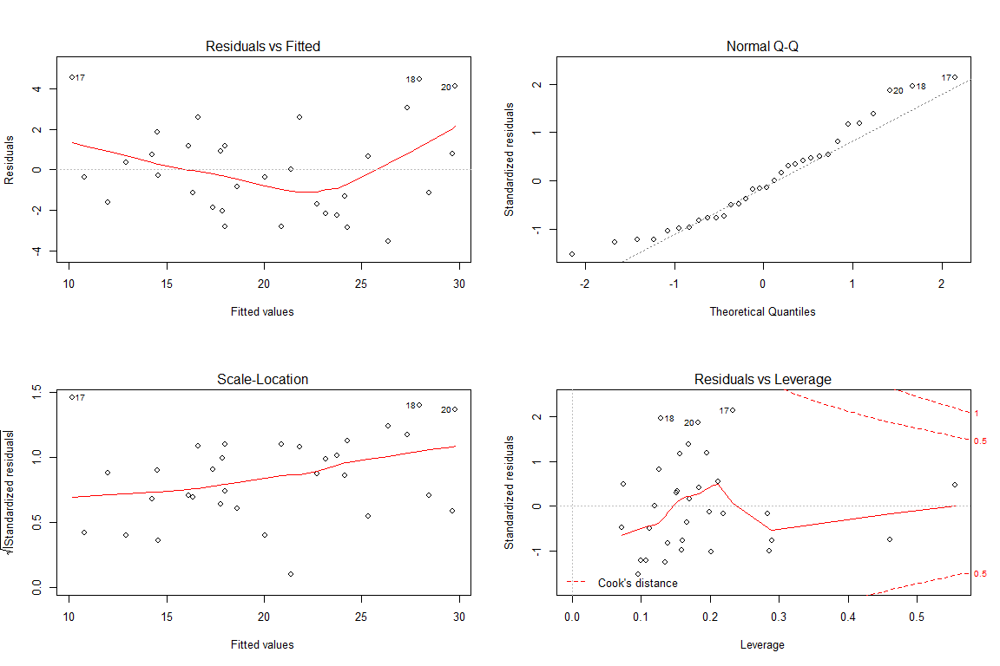
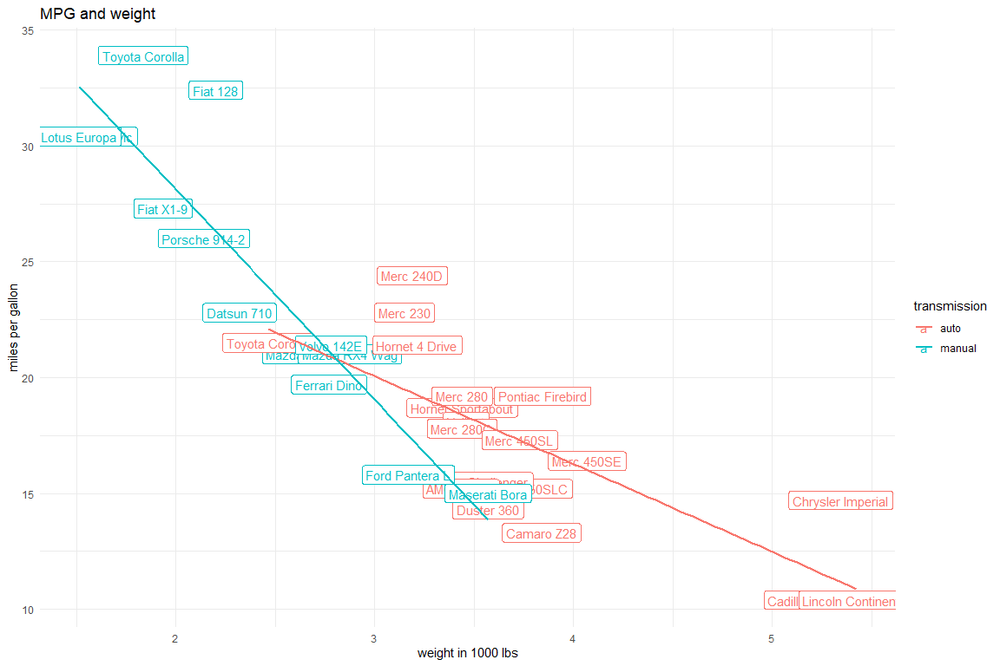

<style>
body {
text-align: justify}
</style>


```r
knitr::opts_chunk$set(echo = TRUE,
                      fig.width = 12,
                      fig.height = 8,
                      warning = FALSE,
                      message = FALSE)
Sys.setlocale(locale = "English")
pacman::p_load(tidyverse, car, psych, DT)
```

# 1. Executive summary
In this document a fuel efficiency of 1970's automobiles is the main subject of interest. In particular, there are 2 major questions of the research:

1. Is an automatic transmission better than manual in regard to US miles per gallon (MPG) travelled?
2. And what is the actual MPG difference between automatic and manual transmissions?

Judging by the results of the study, it appears that there is in fact a significant difference in MPG between the 2 types of transmissions. However, there are certain caveats...

# 2. Analysis
First, we have to prepare the data:

```r
m_df <-
        as_tibble(mtcars, rownames = "models") %>%
        mutate_at("vs", ~factor(., labels = c("V", "S"))) %>% 
        mutate_at("am", ~factor(., labels = c("auto", "manual"))) %>% 
        mutate_at(c("cyl", "gear", "carb"), ~factor(.))
```

## 2.1. Data exploration
The basic overview of the data:

```r
str(m_df)
```

```
## Classes 'tbl_df', 'tbl' and 'data.frame':	32 obs. of  12 variables:
##  $ models: chr  "Mazda RX4" "Mazda RX4 Wag" "Datsun 710" "Hornet 4 Drive" ...
##  $ mpg   : num  21 21 22.8 21.4 18.7 18.1 14.3 24.4 22.8 19.2 ...
##  $ cyl   : Factor w/ 3 levels "4","6","8": 2 2 1 2 3 2 3 1 1 2 ...
##  $ disp  : num  160 160 108 258 360 ...
##  $ hp    : num  110 110 93 110 175 105 245 62 95 123 ...
##  $ drat  : num  3.9 3.9 3.85 3.08 3.15 2.76 3.21 3.69 3.92 3.92 ...
##  $ wt    : num  2.62 2.88 2.32 3.21 3.44 ...
##  $ qsec  : num  16.5 17 18.6 19.4 17 ...
##  $ vs    : Factor w/ 2 levels "V","S": 1 1 2 2 1 2 1 2 2 2 ...
##  $ am    : Factor w/ 2 levels "auto","manual": 2 2 2 1 1 1 1 1 1 1 ...
##  $ gear  : Factor w/ 3 levels "3","4","5": 2 2 2 1 1 1 1 2 2 2 ...
##  $ carb  : Factor w/ 6 levels "1","2","3","4",..: 4 4 1 1 2 1 4 2 2 4 ...
```

The MPG difference can be visualised with the simple violin plots:

```r
ggplot(m_df, aes(y = mpg, x = am, fill = am))+
        geom_violin(draw_quantiles = 0.5, lwd = 1.5)+
    labs(title = "MPG by types of transmission",
         x = "type of transmission",
         y = "miles per gallon")+
    theme_minimal()
```

<!-- -->

It seems like there is a difference between the 2 groups. An attempt can be made to extrapolate this colnclusion beyond the sample and to quantify this difference. But to accomplish the latter, we have to first explore the relationships between the possible predictors of MPG. To do this, we can look at the correlations of continuous variables, namely, "mpg", "disp" (displacement (cu.in.)), "drat" (rear axle ratio), "wt" (weight in 1000 lbs), "qsec" (1/4 mile time). The corresponding plot can be found [here](#corr).

Out of 5 mentioned variables (excluding MPG) 3 are highly linearly correlated with each other. This means possible problems for estimation of variable contribution to the difference in MPG (multicollinearity):

```r
cor.plot(m_df[c("mpg", "hp", "disp", "drat", "wt", "qsec")])
```

<!-- -->

We can also compare variables on their pairwise relationship with MPG. This can give us clues on the possible order of predictor inclusion for the final model. The strongest magnitude of linear relationship can be noticed in the weight variable ($\rho \approx -0.87$).

## 2.2. Is an automatic or manual transmission better for MPG?
We can test our "mpg" variable for normality with Shapiro-Wilk test of normality.
From here and forward on we would use significance level ($\alpha$) = 5%.
[results are here](#shapiro)
With this data we cannot reject the hypothesis that in the overall "population" of the 1970s cars miles per gallon are distributed normally. Of course, we have only 32 samples, so perhaps collecting more data would show otherwise.
By assuming the normality of mpg we can perform a t-test to compare both groups of observations - automatic and manual transmission.

The [output](#ttest) of t-test allows us to conclude that there is in fact a statistically significant difference between the 2 types of transmissions in terms of their fuel economy: automobiles with manual transmission tend to travel longer distances on the same amount of petrol. In the following section we will attempt to estimate this difference.

## 2.3. What is the MPG difference between automatic and manual transmissions?
### 2.3.1. Model fit

We begin with the basic model: $mpg = \beta_0 + \beta_1 * am + \epsilon$. The interpretation of this model is that on average, cars with automatic transmission tend to travel ~17.1 miles per gallon of petrol, while an "average" car with the manual transmission will travel ~7.2 miles longer. However, the quality of the model is not very good (adjusted $R^2 \approx 0.34$), we can do better:

```r
fit0 <- lm(mpg ~ am, data = m_df)
summary(fit0)
```

```
## 
## Call:
## lm(formula = mpg ~ am, data = m_df)
## 
## Residuals:
##     Min      1Q  Median      3Q     Max 
## -9.3923 -3.0923 -0.2974  3.2439  9.5077 
## 
## Coefficients:
##             Estimate Std. Error t value Pr(>|t|)    
## (Intercept)   17.147      1.125  15.247 1.13e-15 ***
## ammanual       7.245      1.764   4.106 0.000285 ***
## ---
## Signif. codes:  0 '***' 0.001 '**' 0.01 '*' 0.05 '.' 0.1 ' ' 1
## 
## Residual standard error: 4.902 on 30 degrees of freedom
## Multiple R-squared:  0.3598,	Adjusted R-squared:  0.3385 
## F-statistic: 16.86 on 1 and 30 DF,  p-value: 0.000285
```

### 2.3.2. Model selection

We can include additional covariates into our model, buliding **several models**. As was mentioned before, we should probably start with the weight ("wt") and then gradually include more variables, leaving previous features untouched (so-called "nested" approach). We can then use ANOVA to test the significance of "model improvement". The entire procedure can be found in the [corresponding section of Appendix](#selection).

Note that we recentered our continuous variables for better interpretability of coefficients [^1]. Thus, the final model ("finfit") can be interpreted in the following terms: if we compare average models (those that have the average weight, displacement, gross horsepower and 1/4 mile time), models with manual transmission tend to travel ~3.5 miles per gallon of petrol longer than models with automatic transmission. The **inference here is that with 95% certainty** we can say that the mentioned cars are travelling from **~0.42** to **~6.52** miles longer on a gallon of petrol:


```r
sc <- summary(finfit)$coef
c_int <- sc[2, 1] + c(-1, 1) * qt(.975, df = finfit$df) * sc[2, 2]
cat("CI 95% for transmission coefficient is from", round(c_int, 2)[1], "to", round(c_int, 2)[2])
```

```
## CI 95% for transmission coefficient is from 0.42 to 6.52
```

### 2.3.3. Model diagnostics

Here are the residuals plots:

```r
par(mfrow = c(2,2))
plot(finfit)
```

<!-- -->

On the $1^{st}$ plot (fitted values vs residuals) we can notice that there is a certain "hockey stick"-like pattern, which basically means that our model fit is not optimal.

The second plot in the series shows us that the standardised residuals are not really normally distributed.
Overall, observations 17, 18 and 20 (Chrysler Imperial, Fiat 128 and Toyota Corolla) break the linear pattern slightly. This might be suggestive of the need for non-linear model.

[^1]: One can notice from the summary of our final model that displacement and gross horsepower are not statistically significant. This happend most likely due to the high correlation between them. The decision to include them in the model was based on 2 facts: (1) removing them would lead to biased coefficients and (2) the only important coefficients for the interpretation are intercept and dummy variable "am" (transmission).

# 3. Appendix {#apndx}

#### Data exploration (scatter plot) {#scatter}

```r
ggplot(m_df, aes(x = wt, y = mpg, color = am))+
        geom_point(cex = 5, alpha = .5)+
        geom_label(aes(label = models), label.size = 0.2)+
        labs(title = "MPG and weight",
             color = "transmission",
             x = "weight in 1000 lbs",
             y = "miles per gallon")+
        geom_smooth(method = lm, se = FALSE)+
        theme_minimal()
```

<!-- -->

#### Normailty test for MPG {#shapiro}

```r
shapiro.test(m_df$mpg)
```

```
## 
## 	Shapiro-Wilk normality test
## 
## data:  m_df$mpg
## W = 0.94756, p-value = 0.1229
```

#### T-test {#ttest}

```r
t.test(mpg ~ am, m_df)
```

```
## 
## 	Welch Two Sample t-test
## 
## data:  mpg by am
## t = -3.7671, df = 18.332, p-value = 0.001374
## alternative hypothesis: true difference in means is not equal to 0
## 95 percent confidence interval:
##  -11.280194  -3.209684
## sample estimates:
##   mean in group auto mean in group manual 
##             17.14737             24.39231
```

#### Model selection {#selection}

```r
fit1 <- lm(mpg ~ am + I(wt - mean(wt)), data = m_df)
fit2 <- lm(mpg ~ am + I(wt - mean(wt)) + I(disp - mean(disp)), data = m_df)
fit3 <- lm(mpg ~ am + I(wt - mean(wt)) + I(disp - mean(disp)) + I(hp - mean(hp)), data = m_df)
fit4 <- lm(mpg ~ am + I(wt - mean(wt)) + I(disp - mean(disp)) + I(hp - mean(hp)) +
                   I(drat - mean(drat)), data = m_df)
anova(fit0, fit1, fit2, fit3, fit4)
```

```
## Analysis of Variance Table
## 
## Model 1: mpg ~ am
## Model 2: mpg ~ am + I(wt - mean(wt))
## Model 3: mpg ~ am + I(wt - mean(wt)) + I(disp - mean(disp))
## Model 4: mpg ~ am + I(wt - mean(wt)) + I(disp - mean(disp)) + I(hp - mean(hp))
## Model 5: mpg ~ am + I(wt - mean(wt)) + I(disp - mean(disp)) + I(hp - mean(hp)) + 
##     I(drat - mean(drat))
##   Res.Df    RSS Df Sum of Sq       F    Pr(>F)    
## 1     30 720.90                                   
## 2     29 278.32  1    442.58 65.5044 1.422e-08 ***
## 3     28 246.56  1     31.76  4.7012  0.039478 *  
## 4     27 179.91  1     66.65  9.8645  0.004171 ** 
## 5     26 175.67  1      4.24  0.6275  0.435428    
## ---
## Signif. codes:  0 '***' 0.001 '**' 0.01 '*' 0.05 '.' 0.1 ' ' 1
```
apparently, fit4 does not improve our model. We replace "drat" variable with "qsec" and start

```r
finfit <- lm(mpg ~ am + I(wt - mean(wt)) + I(disp - mean(disp)) + I(hp - mean(hp)) +
                   I(qsec - mean(qsec)), data = m_df)
anova(fit0, fit1, fit2, fit3, finfit)
```

```
## Analysis of Variance Table
## 
## Model 1: mpg ~ am
## Model 2: mpg ~ am + I(wt - mean(wt))
## Model 3: mpg ~ am + I(wt - mean(wt)) + I(disp - mean(disp))
## Model 4: mpg ~ am + I(wt - mean(wt)) + I(disp - mean(disp)) + I(hp - mean(hp))
## Model 5: mpg ~ am + I(wt - mean(wt)) + I(disp - mean(disp)) + I(hp - mean(hp)) + 
##     I(qsec - mean(qsec))
##   Res.Df    RSS Df Sum of Sq       F    Pr(>F)    
## 1     30 720.90                                   
## 2     29 278.32  1    442.58 74.9946 3.877e-09 ***
## 3     28 246.56  1     31.76  5.3823  0.028457 *  
## 4     27 179.91  1     66.65 11.2936  0.002413 ** 
## 5     26 153.44  1     26.47  4.4853  0.043908 *  
## ---
## Signif. codes:  0 '***' 0.001 '**' 0.01 '*' 0.05 '.' 0.1 ' ' 1
```
